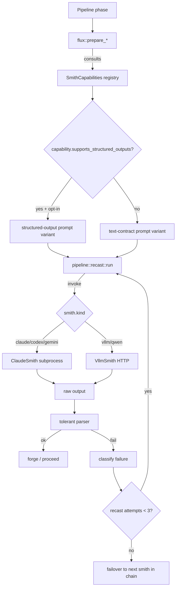
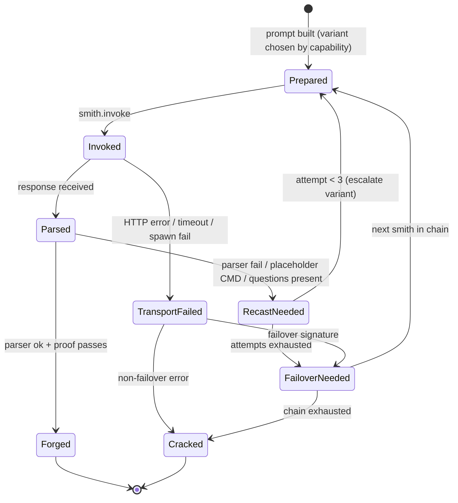

# feat: Smith robustness hardening + vLLM/Qwen support

## Summary

Bring 27–32B-class open-weight smiths (Qwen3 served via the user's LAN vLLM instance) to first-class status alongside Claude, while generalizing existing per-phase recast/retry scaffolding into a shared helper. The plan adds a `VllmSmith` HTTP adapter, smith capability profiles, tolerant parsers, prompt-budget enforcement, structured failure events, an opt-in vLLM `structured_outputs` path, and a fixture-based adherence bench.

## Problem Frame

Slag's smith abstraction is subprocess-only and implicitly Claude-class. Every strict-format contract (`CMD:` suffix, `STATUS: PASS|FAIL`, `(ingot …)` S-expressions, action keywords `REWRITE|SPLIT|IMPOSSIBLE`) lives as ad-hoc text rules near the start of long prompts. Recast/repair loops exist in three places (`founder`, `outcome`, `forge` protocol-retry) but were grown independently — each phase reimplements its own state machine, escalation, and confidence model. The longest prompt (`founder_prompt`) is ~1.2k tokens *before* blueprint concatenation, putting the format contract squarely in lost-in-the-middle territory on small open-weight models. The `failure_signature()` skip-list and `is_protocol_placeholder_cmd` detector exist precisely because Claude already misbehaves at the edges; the same code paths will fail dramatically on Qwen3-class smiths without generalization.

The robustness work and the small-model work are not separable: every failure class small models hit harder is a class large models also hit, just less often. The unifying axis is a **failure-mode taxonomy** — `format_violation`, `parse_unrecoverable`, `cmd_missing`, `questions_present`, `proof_unexecutable`, `truncation`, `wrong_action_keyword`, `http_error`, `auth_error`, `model_busy` — extracted from the existing codebase. Every robustness improvement targets a class; every small-model affordance is justified against the class it fixes.

---

## Requirements

### Smith abstraction

- R1. A new `VllmSmith` adapter at `src/smith/vllm.rs` implements the existing `Smith` trait against vLLM's OpenAI-compatible `/v1/chat/completions` endpoint.
- R2. `VllmSmith` is selectable via the existing `SmithConfig` chain mechanism and auto-detected when `SLAG_VLLM_BASE_URL` is set.
- R3. A `SmithCapabilities` profile is queryable per smith and consulted by `flux.rs` prompt builders to pick prompt variant, sampling, and prompt-repetition mode.

### Robustness

- R4. Every strict-format prompt in `src/flux.rs` flows through a shared recast/repair helper (`src/pipeline/recast.rs`) bounded at three attempts before smith failover.
- R5. Tolerant parsers handle markdown bleed (`**STATUS:**`), case variation, and fenced-block leakage across `STATUS:`, `CMD:`, action keywords, and ingot S-expressions.
- R6. Prompt budget is enforced via `SLAG_PROMPT_BUDGET_TOKENS`; over-budget prompts truncate `[BLUEPRINT]`, `[CRUCIBLE]`, and `[LEDGER]` head-tail before concatenation.
- R7. The format contract block (`CMD:` instruction, RULES) is positioned at the END of every prompt template — immediately before the model's generation slot.

### Observability

- R8. Structured smith events emit failure-class identifiers via `src/events.rs` under the existing dotted namespace (`smith.invoke.{success,failure}`, `smith.recast.{attempt,success,exhausted}`).
- R9. `failure_signature()` skip-list extends to filter new structured-failure envelope lines so distinct failure classes do not collapse into the 3-identical bail.

### Structured output (opt-in)

- R10. `VllmSmith` supports an opt-in structured-output mode via `extra_body.structured_outputs` (`choice`, `grammar`, `regex`) for the action enums, ingot S-expressions, and `CMD:` suffix.
- R11. `finish_reason: "length"` on structured-output calls is treated as a hard failure (silent truncation is not acceptable).

### Verification

- R12. A fixture-based bench/eval suite at `tests/smith_fixtures.rs` runs representative slag prompts against each configured smith and reports per-failure-class adherence rates; CI inclusion is env-gated to avoid requiring vLLM in default builds.

---

## Key Technical Decisions

- **KTD1. Raw `reqwest` + `serde_json::Value`, not `async-openai`.** vLLM's `extra_body` / `structured_outputs` is non-OpenAI; the typed crate cannot model it without escaping back to JSON. `reqwest` is already a direct dep used only by `src/update.rs`; extending its footprint is cheaper than adding a 200-KB typed client.

- **KTD2. Structured output is opt-in alongside text contracts, not canonical.** Making `structured_outputs` canonical for capable smiths would force a parallel parser/prompt rewrite across `flux.rs`. The blast radius outweighs v1 benefit. Capability-gated opt-in adds the JSON/grammar path to the vLLM smith only; Claude continues on text contracts. Reassess once bench data shows the small-model adherence delta on text-vs-structured. Variant explosion is bounded by routing all variant selection through one site — `flux::prepare_*` consults `Smith::capabilities()` once per prompt; structured-output and text-contract prompts share the same prompt body and differ only in the trailing constraint block.

- **KTD3. Qwen3 thinking mode disabled by default for format-strict phases.** arXiv 2606.09662 finds thinking mode worsens Precision constraints (exact suffix lines, enum verdicts) on Qwen3 across 1.7B–32B, and vLLM 0.11.2+ disables `structured_outputs` when reasoning is on. Sent via `extra_body.chat_template_kwargs.enable_thinking: false`. `SLAG_VLLM_ENABLE_THINKING=1` allows override.

- **KTD4. Smith capability profile is attached to the smith instance at construction, surfaced via a `Smith::capabilities()` trait method.** Substring matching on the `SmithConfig` chain (`"claude"`, `"qwen"`, etc.) is brittle — a Kimi-Claude-compat wrapper contains `"claude"` and would silently get the Claude profile; user-renamed chain entries fall back to defaults silently; `route_smith_command` rewrites the prefix. Each adapter constructor (`ClaudeSmith::new`, `VllmSmith::new`, `MockSmith::new`) returns the smith with its capability profile baked in. The trait gets a default-impl method returning a conservative profile, so adapters opt-in by overriding.

- **KTD5. Recast loops bounded at three attempts before failover.** Production guides (apxml.com 2025, FlakyDoctor) and the Mellea framework converge on 2–3 for format-only repair; beyond three, returns collapse. Failover to the next smith in `SmithConfig::base_chain` is more productive than further recast.

- **KTD6. Format contract repositioned to end of prompt (sandwich pattern).** Lost-in-the-middle (Liu et al. TACL 2024; reaffirmed on Qwen3 by Chroma 2025) shows mid-prompt rules degrade above ~1k tokens. Move `CMD:` instruction, RULES, and required suffix tags to immediately before "Now produce…". Small-model capability profile additionally enables Leviathan prompt-repetition (`SLAG_PROMPT_REPEAT_MODE=always`).

- **KTD7. Bench/eval ships with this plan, not as a follow-up.** Without it the robustness improvements are unverifiable and unregress-able. Fixture-based — slag-prompt fixtures asserting adherence per failure class — not full IFEval. Env-gated CI inclusion (`SLAG_BENCH=1`) keeps vLLM out of the default build.

- **KTD8. Self-consistency deferred; routes through `ledger::ExperimentRecord` if needed later.** Research (Wang 2023, DeepConf 2025, Ranked Voting 2025) shows single-sample + guided decoding beats N=5 free-form at lower cost on small models. The existing TOON-tabular ledger already records per-attempt outcomes; any future majority-vote operates over those records, not parallel infrastructure.

- **KTD9. `FailureClass` is both a typed enum (used in process by the recast helper) and an event field (used for observability). Events are the projection, not the source of truth.** The recast helper's variant escalation needs to branch on failure class before emitting the event — a `format_violation` on attempt 1 escalates to structured-output mode on attempt 2, but an `auth_error` does not retry at all. Re-classifying by parsing the event stream is round-trip serialization for in-process logic. The recast helper returns `Result<T, RecastFailure>` where `RecastFailure { class: FailureClass, message: String, attempt: u32 }`; `events.rs` emits the same `class` as a string field on `smith.invoke.failure`. `Ingot` stays narrow.

- **KTD10. The `Smith` trait gains one new method: `invoke_with_constraints(&self, prompt: &str, spec: Option<&StructuredOutputSpec>) -> ...`, default-impl falling through to `invoke(prompt)`.** Routing structured-output specs via side channels on `VllmSmith` would split one concern (which prompt corresponds to which constraint) across two modules (`flux.rs` builds the prompt; `vllm.rs` owns the spec). The default-impl extension keeps `ClaudeSmith` and `MockSmith` working unchanged while making structured-output dispatch a first-class abstraction at the call site. `StructuredOutputSpec` is a small enum (`Choice(Vec<String>)`, `Grammar(&'static str)`, `Regex(String)`).

---

## High-Level Technical Design

### Smith dispatch with capability profile



Directional guidance: the recast helper owns the attempt counter and escalation policy; prompt builders own variant selection; smith adapters own transport. The three concerns currently leak across `forge.rs`, `outcome.rs`, and `founder.rs`.

### Single-strike lifecycle (state machine)



Variant escalation across recast attempts: attempt 0 uses the base text-contract prompt; attempt 1 adds explicit "no preamble, no markdown" + 1–2 few-shot examples; attempt 2 enables structured-output mode for capability-supporting smiths, or simply tightens the format-repair prompt otherwise.

---

## Output Structure

```
src/
  smith/
    vllm.rs           (new) VllmSmith adapter
    response.rs       (new) tolerant parsers + is_protocol_placeholder_cmd
    doctor.rs         (new) slag smith doctor probe routines
    grammars/         (new) GBNF grammars for structured_outputs
      ingot.gbnf
  pipeline/
    recast.rs         (new) bounded_retry + bounded_retry_with_signature
tests/
  smith_fixtures.rs   (new) fixture-driven adherence bench
  fixtures/
    recast_baseline.jsonl  (new) U2 behavior-parity snapshot
    founder/*.txt          prompt fixtures + expected-shape assertions
    outcome/*.txt
    resmelt/*.txt
docs/
  configuration.md    (new) env-var reference + precedence rules
  plans/
    2026-06-30-001-feat-smith-robustness-and-vllm-support-plan.md  (this file)
```

The implementer may adjust layout if implementation reveals a better organization. Per-unit `**Files:**` sections remain authoritative.

---

## System-Wide Impact

Seven cross-cutting surfaces propagate through this work. Each is named here so the unit-level changes can be read against the system-wide picture.

- **Prompt template surface.** Every `flux::prepare_*` and `*_prompt` builder (10+ functions) gains capability-conditional logic; the contract-position swap (U5) changes every generated prompt for every smith. Mitigation: variant selection happens at one site per KTD2; capability is read once via `Smith::capabilities()`.
- **Pipeline phase loop surface.** `forge`, `outcome`, `founder`, `resmelt`, and `review` consume the recast primitives from U2. Behavior regressions corrupt all of them simultaneously. Mitigation: U2 splits into two narrow primitives (stateless and signature-deduplicated); `outcome.rs::MAX_ITERATE` is intentionally left as a confidence loop, not a recast loop.
- **Failover detection surface.** `is_smith_failover_candidate` and `failure_signature` (both in `forge.rs`) gain HTTP-error signatures from U6 and structured-failure envelopes from U1; the `failure_signature` skip-list is consulted by the 3-identical bail in `strike_ingot_with_chain`. Mitigation: U1 explicitly extends the skip-list; U6 round-trip tests assert each new error class maps correctly through both detectors.
- **Smith dispatch surface.** `SmithConfig::base_chain`, `select_chain`, `route_smith_command`, and `auto_detect_smith_chain` gain a non-subprocess code path. Mitigation: `supports_claude_routing_flags` gate keeps Claude-only flags from leaking; vLLM admission in `auto_detect_smith_chain` is gated on `SLAG_VLLM_BASE_URL` presence.
- **Observability surface.** `events.rs` gains failure-class envelope fields; the new envelope is consumed by `failure_signature`'s skip-list. This is the implicit coupling that bit the codebase already per `CLAUDE.local.md` (failure_signature header-pollution incident). Mitigation: U1 extends the skip-list in lock-step with the new event fields; a regression test asserts two events of the same class with different envelope detail share a signature.
- **Auth/HTTP boundary.** New threat surface: bearer token from env, base URL from env, response parsing from untrusted body. No prior slag code crosses this boundary. Mitigation: tokens are never logged; response bodies are truncated via the existing `truncate_output` (5-head / 30-tail / 4 KB) before surfacing in errors; `Bearer None` regression test in U6 prevents the vLLM auth bug.
- **Configuration surface.** Five new env vars (`SLAG_VLLM_BASE_URL`, `_MODEL`, `_API_KEY`, `_TIMEOUT_SECS`, `_ENABLE_THINKING`) plus `SLAG_PROMPT_BUDGET_TOKENS` and `SLAG_BENCH`, plus OpenAI-compat fallbacks (`OPENAI_BASE_URL`, `OPENAI_API_KEY`). Mitigation: U10 documents precedence; `slag smith doctor` (U9) reports the resolved values.

---

## Implementation Units

### U1. Failure-mode taxonomy and structured smith events

**Goal:** Establish the failure classification system every other unit hooks into.

**Requirements:** R8, R9

**Dependencies:** none

**Files:**
- `src/events.rs` — add `FailureClass` enum + emit helpers
- `src/pipeline/forge.rs` — extend `failure_signature` skip-list (around line 1316), wire emission at `strike_ingot_with_chain` boundary
- `src/smith/mod.rs` — typed result with optional `FailureClass` for transport-layer failures

**Approach:**
Define a `FailureClass` enum with variants matching the taxonomy in Problem Frame. The enum is the in-process source of truth — parsers return it, `Smith::invoke*` returns it via `RecastFailure`, and the recast helper branches on it (per KTD9). `events.rs` emits `smith.invoke.{success,failure}` and `smith.recast.{attempt,success,exhausted}` with a `failure_class` string field as the observability projection. Extend `failure_signature()` to skip event-envelope lines (`FailureClass:`, `Smith:`, `Attempt:`) in addition to the existing `=== HEAT`, `Type:`, `Exit:`, `CMD:` filters. Do not add the field to `Ingot` — classification stays in the typed result and the event stream.

**Patterns to follow:** existing `events::emit_warn("smith.invoke.timeout", …)` shape in `src/smith/claude.rs`; existing skip-list filter in `src/pipeline/forge.rs::failure_signature`.

**Test scenarios:**
- Each `FailureClass` variant constructs a `RecastFailure` with the expected `class`, `message`, and `attempt`.
- `events.rs` emit helpers serialize `failure_class` as a string matching the enum variant name.
- `failure_signature` returns the same signature for two events of the same class with different envelope detail (proves the skip-list works).
- `failure_signature` returns different signatures for two events of different classes (proves identical-bail does not collapse distinct failure classes).
- Pre-existing `failure_signature` behavior is unchanged for inputs that contain none of the new envelope fields (regression guard).

**Verification:** Previously-passing tests remain green; an observed slag run records new `failure_class` fields in the per-run events.jsonl with each failure path producing a distinct class string.

---

### U2. Generalized recast/repair primitives

**Goal:** Move the per-phase format-recast logic into one place — without forcing the helper to absorb every loop in the system.

**Requirements:** R4

**Dependencies:** U1

**Files:**
- `src/pipeline/recast.rs` (new) — two primitives + escalation helper
- `src/pipeline/forge.rs` — replace inline `MAX_INFRA_RETRIES` loop in `strike_ingot_with_chain` (~lines 1017–1083) with `bounded_retry_with_signature`
- `src/pipeline/founder.rs` — replace MAX_ITERATE loop (~lines 42–64) with `bounded_retry`
- `src/pipeline/resmelt.rs` — wrap resmelt prompt path with `bounded_retry`
- `src/pipeline/review.rs` — wrap reviewer-lane parsing with `bounded_retry`

**Approach:**
Two primitives, not one. The three currently-independent loops have different state shapes and forcing them behind a single `RecastSpec` would create a swiss-army knife.

- `bounded_retry(prompt_builder, recast_prompt_builder, parser, escalation_fn, max_attempts)` — stateless format repair for founder, resmelt, and reviewer-lane parsing. Escalation across attempts: 0 base prompt; 1 strict-format reminder + few-shot if capability supports; 2 structured-output mode if `Smith::capabilities().supports_structured_outputs` and a `StructuredOutputSpec` is registered for this phase, otherwise tighter text prompt.
- `bounded_retry_with_signature(…, signature_fn, identical_bail)` — adds the 3-identical bail and failure-signature deduplication that `strike_ingot_with_chain` requires for protocol retries.

`outcome.rs::MAX_ITERATE` is **intentionally not migrated**: that loop is a confidence policy (it scores outcome answers and escalates to a subagent on low confidence), not a format-recast policy. It keeps its current shape but consumes shared components from U3 (tolerant parsers) and emits the U1 events. The unit's Approach makes the boundary explicit.

Both primitives return `Result<T, RecastFailure>` per KTD9. On exhausted, `FailureClass::ParseUnrecoverable` triggers `is_smith_failover_candidate`. Each attempt emits a `smith.recast.attempt` event with the typed `failure_class` from the previous attempt's `RecastFailure`.

**Execution note:** Add characterization fixtures for `forge`, `founder`, `resmelt`, `review` before refactoring — these are load-bearing paths and behavior must round-trip exactly on the Claude path. A `MockSmith` script that drives each phase through one happy-path and one recast-once path serves as the baseline.

**Patterns to follow:** the resmelt retry-contract validation in `src/pipeline/resmelt.rs::validate_retry_contract` (line 269) — same shape of "parser + escalation + bounded attempts".

**Test scenarios:**
- `bounded_retry` with always-failing parser exhausts after exactly `max_attempts` invocations and returns `FailureClass::ParseUnrecoverable`.
- `bounded_retry` whose parser succeeds on attempt 2 emits `smith.recast.attempt` twice and `smith.recast.success` once.
- The escalation function receives `attempt: 0..max_attempts` and can switch prompt variant; on attempt 2 with a capable smith it returns the structured-output variant.
- `bounded_retry_with_signature` triggers identical-bail on the third identical signature even when `max_attempts` would otherwise allow more.
- A `RecastSpec` parser returning `Ok` on first attempt emits zero `recast.attempt` events (zero-recast happy path).
- Behavior parity fixture: `MockSmith` driving founder → forge → outcome through one happy-path + one recast-once path produces a byte-identical event stream pre- and post-refactor (snapshot at `tests/fixtures/recast_baseline.jsonl`).

**Verification:** Pre-existing forge/founder/resmelt/review integration tests remain green; the baseline-fixture event stream is byte-identical pre- and post-refactor; `outcome.rs::MAX_ITERATE` retains its confidence-loop shape (proved by an existing outcome-confidence integration test still passing without modification).

---

### U3. Tolerant parsers for strict-format contracts

**Goal:** Make the existing strict parsers in `outcome.rs`, `review.rs`, `resmelt.rs` tolerate markdown bleed, case variation, and fenced-block leakage uniformly.

**Requirements:** R5

**Dependencies:** U1

**Files:**
- `src/smith/response.rs` (new) — shared tolerant header / action-keyword / CMD extractors plus the relocated `is_protocol_placeholder_cmd`
- `src/pipeline/outcome.rs` — replace `parse_outcome_response` field lookups with shared helpers
- `src/pipeline/review.rs` — replace `parse_lane_review_response` field lookups
- `src/pipeline/resmelt.rs` — replace action-keyword detection (line 251)
- `src/proof.rs` — wrap `extract_cmd` with the new last-CMD-line tolerant extractor
- `src/pipeline/forge.rs` — drop the local `is_protocol_placeholder_cmd` definition (now imported from `smith/response.rs`)

**Approach:**
Three tolerant helpers plus a relocated detector, all in `src/smith/response.rs`. Placement reasoning: these helpers normalize *smith outputs*, not pipeline state — same domain as `claude.rs` and `vllm.rs`. Co-locating `is_protocol_placeholder_cmd` (currently in `forge.rs:1403`) here closes the same domain boundary.

- `extract_header(text, key)` — case-insensitive, accepts `**KEY:**` / `Key:` / `KEY:`, ignores fenced-block leakage.
- `extract_action_keyword(text, candidates)` — returns the first matching variant from a closed set like `[REWRITE, SPLIT, IMPOSSIBLE]`.
- `extract_trailing_cmd(text)` — last-occurrence `CMD:` line preference, strips fenced-block wrappers, rejects placeholder values via `is_protocol_placeholder_cmd`.

Model on the existing `infer_status_from_text` / `infer_test_from_text` helpers in `src/pipeline/outcome.rs::parse_outcome_response`. The shared module replaces ~6 hand-rolled `lines().find(|l| l.starts_with(…))` patterns. Each helper returns `Result<T, FailureClass>` so callers can route parser failures into the recast escalation function from U2.

**Patterns to follow:** `parse_outcome_response::infer_*` in `src/pipeline/outcome.rs:567`; `is_protocol_placeholder_cmd` in `src/pipeline/forge.rs:1403`.

**Test scenarios:**
- `extract_header` finds `STATUS: PASS` in `"**STATUS:** PASS"`, `"Status:  pass"`, `"```\nSTATUS: PASS\n```"`, `"<output>\nSTATUS: PASS\n</output>"`.
- `extract_header` returns None when the key is absent (does not pull garbage).
- `extract_action_keyword` finds `IMPOSSIBLE` in `"**IMPOSSIBLE:** budget exhausted"` and in plain `"IMPOSSIBLE: budget"`.
- `extract_action_keyword` returns the first match when two appear (defensive against models that hedge).
- `extract_trailing_cmd` returns the *last* `CMD:` line, not the first (matches existing `extract_cmd` semantics).
- `extract_trailing_cmd` rejects `CMD: <shell command>` and other placeholder hallucinations via `is_protocol_placeholder_cmd`.
- Existing `parse_outcome_response`, `parse_lane_review_response`, resmelt action-keyword tests still pass after refactor.

**Verification:** Helper-level unit tests cover each tolerant-parse case above; pre-existing parser tests in `outcome`, `review`, `resmelt` remain green after import-site swap; the bench in U8 reports ≥10% adherence-rate improvement on the slag fixtures for the small-model profile (this requires U6 in place to measure).

---

### U4. Smith capability profiles via trait method

**Goal:** Centralize the per-smith knowledge that prompt builders, sampling defaults, and recast escalation each consult — without coupling lookup to a fragile string match on the dispatch chain.

**Requirements:** R3

**Dependencies:** U1 (soft — only for event-field consistency; can land in parallel)

**Files:**
- `src/smith/mod.rs` — extend `Smith` trait with `fn capabilities(&self) -> &SmithCapabilities`, default-impl returning a conservative profile
- `src/config.rs` — `SmithCapabilities` struct and `RecastStrategy` enum; defaults moved out of the constructor sites
- `src/smith/claude.rs` — `ClaudeSmith` stores its capability profile; `capabilities()` returns a reference
- `src/smith/mock.rs` — `MockSmith` uses the trait default
- `src/flux.rs` — consult `smith.capabilities()` once per prompt build for repeat mode and variant selection
- `src/smith/claude.rs::maybe_repeat_prompt` — reads mode from the capability profile via the trait; `SLAG_PROMPT_REPEAT_MODE` becomes an override, not the source of truth

**Approach:**
```
SmithCapabilities {
  name: &'static str,
  context_window: usize,
  supports_thinking_toggle: bool,
  supports_structured_outputs: bool,
  recast_strategy: RecastStrategy,   // Aggressive | Conservative
  few_shot_examples: bool,
  prompt_repeat_mode: PromptRepeatMode,
  default_temperature: f32,
  default_top_p: f32,
  default_top_k: u32,
}
```

Each adapter constructor (`ClaudeSmith::new`, `VllmSmith::new`, `MockSmith::new`) builds and stashes its own profile. `Smith::capabilities()` returns a reference; the trait default returns a `ConservativeDefault` (no structured outputs, no thinking toggle, `NonPlan` repeat, conservative recast). This eliminates substring matching on the `SmithConfig` chain and removes the silent-fallback failure mode where a Kimi-Claude-compat wrapper would inherit the Claude profile.

Defaults — vllm/qwen: `context_window: 32_768`, `supports_thinking_toggle: true`, `supports_structured_outputs: true`, `recast_strategy: Aggressive`, `few_shot_examples: true`, `prompt_repeat_mode: Always`, `default_temperature: 0.7`, `default_top_p: 0.8`, `default_top_k: 20`. Claude: existing behavior (no thinking toggle, no structured outputs, conservative recast, no few-shot, `NonPlan` repeat).

**Patterns to follow:** existing env-var-default pattern in `src/smith/claude.rs::smith_timeout_secs` and `PromptRepeatMode::from_env`; existing default-impl pattern on `Smith::invoke_in_dir` (line 21-27) — the new `capabilities()` follows the same shape.

**Test scenarios:**
- `ClaudeSmith::new()` then `.capabilities()` returns the claude profile by value.
- `VllmSmith::new()` then `.capabilities()` returns the vllm profile.
- `MockSmith::new()` then `.capabilities()` returns the conservative default (proves the trait default-impl fires).
- A custom test smith implementing only `invoke` inherits the conservative default for `capabilities()`.
- `SLAG_PROMPT_REPEAT_MODE=off` overrides the vllm profile's `Always` at the call site in `maybe_repeat_prompt`.
- Adding a field to `SmithCapabilities` touches at most the three adapter constructors and the struct definition (proves the abstraction boundary).

**Verification:** Pre-existing tests remain green; an observed slag run with `SLAG_SMITH=claude` produces prompts byte-identical to pre-refactor output (proves the claude profile is the new home for what was implicit behavior); an observed slag run with `SLAG_VLLM_BASE_URL=…` activates the vllm profile.

---

### U5. Prompt-budget enforcement and format-contract repositioning

**Goal:** Stop the format contract from drowning in the middle of long prompts on small models.

**Requirements:** R6, R7

**Dependencies:** U4

**Files:**
- `src/flux.rs` — `prepare_flux_cached`, `prepare_resmelt_flux`, `prepare_reconsider_flux`, `prepare_outcome_flux`, `surveyor_prompt`, `founder_prompt`, `regenerate_prompt`, `prepare_review_flux`, `prepare_reviewer_lane_flux`
- `src/config.rs` — `SLAG_PROMPT_BUDGET_TOKENS` env var with sensible default per capability

**Approach:**
Two structural changes:

1. **Sandwich positioning:** in every flux template, move the format contract block (`End with exactly: CMD: …`, RULES, action-keyword enumeration, S-expression template) from its current early position to immediately before the model's generation slot. The blueprint / crucible / ledger context goes first; the contract goes last. `compact_crucible` (line 613) is already the seed for this — keep context compact, push contract to end.

2. **Budget enforcement:** in `prepare_flux_cached`, after assembling the prompt body but before appending the contract, measure approximate token count (chars/4 heuristic — token-counting is intentionally cheap, not exact). If over `capability.context_window * 0.7`, truncate `[BLUEPRINT]`, `[CRUCIBLE]`, and `[LEDGER]` head-tail-style (keep first 30% and last 30%, drop middle) until under budget. `SLAG_PROMPT_BUDGET_TOKENS` overrides the per-capability default.

Small-model capability profiles additionally trigger `PromptRepeatMode::Always` on the **contract section only** (via `repeat_tail` in `src/smith/claude.rs:412`), not the whole prompt.

**Patterns to follow:** existing `compact_crucible` head-truncation in `src/flux.rs:613`; existing `repeat_tail` partial-repetition in `src/smith/claude.rs:412`.

**Test scenarios:**
- A 5-KB blueprint + 3-KB crucible prompt is left untouched when capability `context_window` is 200K (Claude).
- The same prompt is truncated head-tail when capability `context_window` is 32K and budget pressure hits.
- For every flux template, the rendered prompt's `CMD:` instruction appears within the last 500 chars; for the prior baseline (claude profile, pre-repositioning), the instruction appears within the first 2000 chars of the body (proves the swap is real per-profile).
- Truncation preserves at least the most recent crucible entries (tail) and the blueprint's top-of-file (head).
- `SLAG_PROMPT_BUDGET_TOKENS=4000` env override truncates aggressively even for Claude.
- Snapshot: founder prompt rendered with claude capability vs vllm capability shows three concrete differences: contract appears at the end (vllm) vs near the body's middle (claude baseline); few-shot examples present (vllm) vs absent (claude); tail-repetition applied (vllm) vs untouched body (claude).

**Verification:** Pre-existing tests remain green; a debug-mode slag run emits `smith.prompt_repeat.partial_tail` events for vllm-profile prompts but not for claude-profile prompts; the rendered vllm founder prompt is measurably shorter (or same-length with contract-at-end) than the claude-profile baseline.

---

### U6. vLLM smith adapter

**Goal:** Make Qwen3 (or any OpenAI-compatible HTTP smith) usable as a drop-in `Smith` implementation, wired through the existing failover chain.

**Requirements:** R1, R2

**Dependencies:** U4

**Files:**
- `src/smith/vllm.rs` (new) — `VllmSmith` struct, `Smith` impl
- `src/smith/mod.rs` — `pub mod vllm`, re-exports
- `src/config.rs` — extend `SmithConfig::auto_detect_smith_chain` for `SLAG_VLLM_BASE_URL` presence; extend `resolve_smith_alias` for `"vllm"` and `"qwen"`; extend `is_smith_failover_candidate` (in `src/pipeline/forge.rs:1299`) for HTTP 429 / 503 / connect-refused / model-busy signatures; extend `route_smith_command` to skip Claude-only flags via `supports_claude_routing_flags` gating

**Approach:**
Construct `VllmSmith` from env (config struct):
- `SLAG_VLLM_BASE_URL` (required); fall back to `OPENAI_BASE_URL`
- `SLAG_VLLM_MODEL` (required) — exact model id, probed against `/v1/models` on construction
- `SLAG_VLLM_API_KEY` (optional, default `"EMPTY"`); fall back to `OPENAI_API_KEY`; never send `Bearer None`
- `SLAG_VLLM_TIMEOUT_SECS` (optional, falls back to `SLAG_SMITH_TIMEOUT_SECS`)
- `SLAG_VLLM_ENABLE_THINKING` (optional, default `false` per KTD3)
- Slag-specific vars win over OpenAI-compat fallbacks; document precedence

Single shared `reqwest::Client` built with `connect_timeout(10s)`, `tcp_keepalive(30s)`, `pool_idle_timeout(30s)`, rustls-tls (matches `src/update.rs:25`). Verify the project's `reqwest` features expose `pool_idle_timeout` / `tcp_keepalive` / `connect_timeout` — these are default on `reqwest 0.12` but worth confirming during implementation. Request body is `serde_json::json!({...})` with `model`, `messages: [{role:"user", content: prompt}]`, sampling pulled from capability defaults, `stream: false`, and `extra_body: {top_k, chat_template_kwargs: {enable_thinking: <flag>}}`.

`invoke_with_constraints(prompt, spec)` (per KTD10) extends the request body with `extra_body.structured_outputs` when `spec` is `Some` — U7 owns the spec construction. The default `invoke` path delegates to `invoke_with_constraints(prompt, None)`.

`maybe_repeat_prompt` is invoked at the top of `invoke_with_constraints` keyed by `self.capabilities()` (not by command string), so vLLM gets tail-repetition when its profile sets `prompt_repeat_mode: Always`.

Response: parse to `serde_json::Value`, pluck `["choices"][0]["message"]["content"].as_str()`. Map errors to `SlagError::SmithFailed`:
- Connect error → `"connect: <reason>"` (extend `is_smith_failover_candidate` signature match for this prefix)
- Timeout → `"timeout after Ns"` (existing failover signature)
- Non-2xx 5xx (except 503) → `"http <status>: <body>"` (failover candidate)
- HTTP 429 / 503 with `Retry-After` header — single in-adapter retry with `min(retry_after, 5s)` wait before propagating as failover candidate; mirrors the spirit of the `should_retry_with_claude_subscription` one-shot recovery in `src/smith/claude.rs:242`
- HTTP 401 / 403 → `"http 401: <body>"` — NOT a failover candidate (config issue; retrying on another smith won't help)
- JSON parse failure → `"vllm parse: <truncated body>"` (truncated via existing `truncate_output`)
- Empty `choices` array → `"vllm: empty choices"`
- `finish_reason: "length"` on structured calls (set in U7) → `"vllm: length-truncated"` (NOT a failover candidate; budget/grammar surface to the user)

`invoke_in_dir` falls through to `invoke` (vLLM has no cwd semantics; matches the Smith trait default). In-flight requests are aborted when the spawning task is dropped — `reqwest`'s future is cancellation-safe under tokio, so `anvil::worktree` cancellation semantics carry through without explicit handling.

**Patterns to follow:** `reqwest::Client::builder()` construction in `src/update.rs:25`; `tokio::time::timeout` pattern in `src/smith/claude.rs:188`; env-var-default helpers in `src/smith/claude.rs::smith_timeout_secs`; existing `events::emit_warn` shape with dotted namespace.

**Test scenarios:**
- Happy path: mock vLLM server returns valid `choices[0].message.content`; `invoke` returns the string.
- Connect failure: server unreachable → `SmithFailed("connect: ...")`; `is_smith_failover_candidate` returns true for this error string.
- Timeout: server hangs past `SLAG_VLLM_TIMEOUT_SECS` → `SmithFailed("timeout after Ns")`; failover candidate.
- HTTP 429 with `Retry-After: 1`: adapter sleeps 1s, retries once, succeeds → `invoke` returns the second-attempt content (proves the in-adapter recovery).
- HTTP 429 with no `Retry-After` and the retry also fails: `SmithFailed("http 429: ...")`; failover candidate.
- HTTP 503: same retry-then-failover behavior.
- HTTP 401: `SmithFailed("http 401: ...")` with auth hint; NOT a failover candidate.
- Empty choices: `SmithFailed("vllm: empty choices")`; failover candidate.
- Bearer None defense: with no env vars set for keys, request sends `Authorization: Bearer EMPTY` (regression test for vLLM issue #33412).
- `OPENAI_BASE_URL` fallback: with `SLAG_VLLM_BASE_URL` unset and `OPENAI_BASE_URL` set, adapter constructs successfully and uses the OpenAI URL.
- `enable_thinking` injection: default request body contains `extra_body.chat_template_kwargs.enable_thinking: false`; with `SLAG_VLLM_ENABLE_THINKING=1`, it becomes `true`.
- Per-request timeout override: grade-5 ingot prompt gets a longer per-call timeout than grade-1 (via capability + ingot field).
- Repetition wiring: vllm profile's `prompt_repeat_mode: Always` causes `maybe_repeat_prompt` to fire on `invoke_with_constraints`; with the env override `SLAG_PROMPT_REPEAT_MODE=off`, the prompt is sent verbatim.
- Round-trip to failover detector: a `SmithFailed` value for each of the 8 transport classes above feeds into `is_smith_failover_candidate` with the verdict above (true for connect/timeout/429-final/503-final/empty-choices; false for 401/length-truncated).
- Round-trip to failure signature: two `SmithFailed` errors of different classes produce different `failure_signature` outputs; two errors of the same class but different body produce the same signature.
- Drop semantics: a dropped `anvil` task aborts the in-flight HTTP request (proven by observing the vLLM server-side log not receiving the cancelled request's full response time).

**Verification:** Pre-existing tests remain green; a mock-vLLM server-backed integration test exercises each transport class; an end-to-end slag run against the user's actual vLLM forges one trivial ingot to `forged` status with `SLAG_SMITH=vllm`.

---

### U7. Structured-output opt-in path

**Goal:** Make format violations near-impossible on the vLLM smith for the action enums, ingot S-expressions, and `CMD:` suffix.

**Requirements:** R10, R11

**Dependencies:** U4, U6

**Files:**
- `src/smith/mod.rs` — `StructuredOutputSpec` enum (`Choice(Vec<String>)`, `Grammar(&'static str)`, `Regex(String)`); add `invoke_with_constraints` to the `Smith` trait with default-impl (per KTD10)
- `src/smith/vllm.rs` — override `invoke_with_constraints` to inject `extra_body.structured_outputs`
- `src/smith/grammars/ingot.gbnf` (new) — GBNF grammar for `(ingot :id "..." :status ore ...)` S-expression
- `src/flux.rs` — phase-keyed registry mapping prompt-template → `Option<StructuredOutputSpec>`; the dispatcher decides spec at the same site where it builds the prompt body
- `src/pipeline/*` — call sites switch from `smith.invoke(p)` to `smith.invoke_with_constraints(p, spec)` where the phase has a registered spec

**Approach:**
Three structured constraint types in use:

- **`Choice`** for closed enums: `STATUS: PASS|FAIL`, `STATUS: APPROVED|REJECTED`, action keywords `REWRITE|SPLIT|IMPOSSIBLE`, `FIX_INGOTS: NONE|PRESENT`. Smallest grammar, biggest wins for the verdict-style phases.
- **`Grammar`** (GBNF via xgrammar) for `(ingot :id "..." :status ore :solo t :grade N :skill default :heat 0 :max 5 :smelt 0 :proof "..." :work "...")` — covers founder, regenerate, resmelt, reconsider outputs. One grammar file at `src/smith/grammars/ingot.gbnf`, applied via `extra_body.structured_outputs.grammar`.
- **`Regex`** for the trailing `CMD: <shell>` line and the outcome `TEST: <shell>` line.

Backend: pin `extra_body.structured_outputs.backend: "xgrammar:no-fallback"` so unsupported constructs fail loud rather than silently drop — silent constraint-drop is worse than the parse failure that triggers our recast loop (per RedHat 2025 guidance).

Dispatch: the phase-keyed registry in `flux.rs` returns `Option<StructuredOutputSpec>` for each prompt template. The pipeline calls `smith.invoke_with_constraints(prompt, spec)`. `ClaudeSmith` and `MockSmith` use the trait default (ignore the spec, call `invoke`). `VllmSmith` overrides to inject the spec into the request body, but only when `self.capabilities().supports_structured_outputs` is true — proves the capability gate is the source of truth.

`finish_reason: "length"` on a structured call returns a hard error per R11 — the model couldn't fit a valid output in `max_tokens`. Surfaced distinctly so the recast helper either raises `max_tokens` or downsizes prompt rather than retrying the same way.

**Patterns to follow:** existing capability-gated prompt selection from U4; `is_protocol_placeholder_cmd` style of guard from `src/pipeline/forge.rs:1403`.

**Test scenarios:**
- `Choice` on STATUS enum: mock vLLM accepts the request body with `extra_body.structured_outputs.choice: ["PASS", "FAIL"]` and returns one of them.
- `Grammar` on ingot S-expression: mock vLLM accepts `extra_body.structured_outputs.grammar: "<GBNF>"` and returns a parseable ingot.
- `Regex` on CMD line: mock vLLM accepts the regex and returns a single matching line.
- `finish_reason: "length"` on a structured call returns `SmithFailed("vllm: length-truncated")` AND is NOT a failover candidate.
- A phase with no structured-spec registered sends a plain request (no `extra_body.structured_outputs`).
- vLLM 0.12+ `structured_outputs` namespace is used; we do not emit legacy `guided_choice` fields.
- Capability gate: with `supports_structured_outputs: false` on the vllm profile (manual override), even a known-shape phase sends a plain request — proves the gate is the source of truth.
- Backend unavailable: mock vLLM returns 400 with `"xgrammar backend not installed"` body → `SmithFailed("http 400: xgrammar backend not installed")`; failover candidate (the user can fall back to the text-contract claude path).
- Version mismatch: mock vLLM returns 400 with `"unknown field structured_outputs"` (pre-0.12 server) → `SmithFailed("http 400: unknown field structured_outputs")`; failover candidate; error message includes a hint to upgrade vLLM or set `supports_structured_outputs: false` in the profile.
- Grammar compile error: mock vLLM returns 400 with `"grammar parse error at line N"` (malformed GBNF) → `SmithFailed`; NOT a failover candidate (developer-fix-the-grammar surface, not a try-another-smith surface).
- Trait stability: `ClaudeSmith` and `MockSmith` calls to `invoke_with_constraints(prompt, Some(spec))` route through the default-impl and ignore the spec (proven by mock asserting no constraint-header reaches the underlying invoke).
- Adherence bench (cross-reference U8): on the founder phase, vllm-profile-with-structured vs vllm-profile-text-only shows ≥3× lower `format_violation` rate.

**Verification:** Pre-existing tests remain green; mock-vLLM integration tests exercise each constraint type and each error class; an end-to-end slag run against the user's actual vLLM produces parseable founder output ≥95% of the time across 10 runs (measured via U8 bench).

---

### U8. Bench/eval fixture suite

**Goal:** Provable adherence per failure-class, regress-able in CI when the user wants vLLM in the loop.

**Requirements:** R12

**Dependencies:** U2, U3, U6

**Files:**
- `tests/smith_fixtures.rs` (new) — bench harness, env-gated by `SLAG_BENCH=1`
- `tests/fixtures/founder/*.txt`, `tests/fixtures/outcome/*.txt`, `tests/fixtures/resmelt/*.txt` (new) — representative prompt fixtures with expected-shape assertions
- `src/smith/mock.rs` — extend with scripted-response mode for offline bench validation

**Approach:**
Each fixture file is a `<prompt body>\n---ASSERT---\n<assertion spec>` document. Assertion specs are line-oriented and parse to a small vocabulary: `parseable_ingot` (calls `parse_crucible` on response), `trailing_cmd` (calls `extract_trailing_cmd`), `status_enum: PASS|FAIL`, `action_keyword: REWRITE|SPLIT|IMPOSSIBLE`. Discovery uses `walkdir` at test startup over `tests/fixtures/{founder,outcome,resmelt}/*.txt` — adding a fixture file requires no code changes. The harness runs each fixture against each configured smith, parses the response, and records `(smith, fixture, failure_class)` tuples. Adherence rate per class is reported as `passed / total`.

Two modes: **CI mode** (`SLAG_BENCH=1`, default off) runs against whatever smiths are configured, including vLLM when its env vars are set; **offline mode** uses `MockSmith` with scripted responses to validate the harness logic itself without a live vLLM.

The bench is descriptive, not prescriptive — it does not gate merges automatically. Output is a markdown table on stdout that surfaces regression candidates. A future plan can add CI gating once adherence baselines stabilize.

**Patterns to follow:** existing `MockSmith` in `src/smith/mock.rs`; existing bash-test pattern in `tests/test_slag.sh`; existing `cargo test --all` integration via `assert_cmd` + `tempfile` (already dev-deps).

**Test scenarios:**
- Harness with `MockSmith` returning a known-good ingot reports `format_violation: 0/1` for the founder fixture.
- Harness with `MockSmith` returning prose-prefaced output reports `format_violation: 1/1` for the founder fixture and identifies the class as `format_violation`.
- Harness with `MockSmith` returning `"<shell command>"` placeholder reports `cmd_missing: 1/1` after `is_protocol_placeholder_cmd` rejection.
- Harness against the user's actual vLLM (env-gated): adherence rate per class is reported; at least one full pass succeeds.
- Adding a new fixture file does NOT require code changes — the harness discovers files in `tests/fixtures/`.
- `SLAG_BENCH=1 cargo test smith_fixtures` produces a stdout report; default `cargo test --all` does not run the bench (proves env gating).

**Verification:** Pre-existing tests remain green; enabling bench mode produces a stdout adherence-rate table; default test mode does not run the bench (proves the env gating); a manual bench run against the user's vLLM produces a populated table for every fixture × smith combination.

---

### U9. `slag smith doctor` command

**Goal:** Give users a single command that diagnoses smith configuration without reading event logs.

**Requirements:** supports R1-R3 (operational follow-through)

**Dependencies:** U4, U6

**Files:**
- `src/cli.rs` — add `Smith { #[command(subcommand)] subcommand: SmithCmd }` variant; `SmithCmd::Doctor`
- `src/smith/doctor.rs` (new) — probe routines and table renderer
- `src/main.rs` — wire `slag smith doctor` to `doctor::run`

**Approach:**
For each configured smith in the resolved chain, probe:
- Subprocess smiths (Claude / codex / gemini): run the binary with a version-probe arg (`claude --version`, `codex --version`, etc.); check exit code; capture stdout first line.
- `VllmSmith`: GET `/v1/models`, then issue a one-token completion to confirm model load.
- All smiths: print resolved capability profile (read via `Smith::capabilities()`).

Render a colored table with columns `smith | resolved command/URL | reachable | model | capability_summary`. Exit non-zero if any required smith is unreachable (matches existing CLI conventions).

**Patterns to follow:** existing `cli.rs` clap-derive pattern; `tui.rs` colored output via `crossterm` style helpers.

**Test scenarios:**
- `slag smith doctor` with only `claude` in chain runs the version probe and reports the version string.
- `slag smith doctor` with `SLAG_VLLM_BASE_URL` set probes `/v1/models` and prints the served model id.
- `slag smith doctor` with an unreachable vLLM exits non-zero with a clear error pointing to the env var and the connect failure.
- `slag smith doctor` honors `SLAG_VLLM_API_DIALECT` is N/A — the plan does not ship a dialect fallback (per Risks section).
- Capability column reflects the profile from `Smith::capabilities()` (e.g., `claude: conservative, no structured`, `vllm: aggressive, structured ok`).
- Bearer None defense applies here too: doctor probe sends `Authorization: Bearer EMPTY` when no key is configured.

**Verification:** Running the new command on a fresh checkout against the user's vLLM prints a reachable row; pointing it at a known-bad URL exits non-zero and surfaces the specific failure class from U1.

---

### U10. README and environment-variable reference

**Goal:** Document the new env vars, the precedence rules, and the migration path for users currently on Claude-only setups.

**Requirements:** supports R1-R3, R6, R10 (user-facing operational)

**Dependencies:** U6, U7, U9

**Files:**
- `README.md` — add a "Smiths" section with the resolved chain explanation; a short example for vLLM/Qwen setup
- `docs/configuration.md` (new) — full env-var reference table (existing + new), precedence rules, capability profile defaults
- `CLAUDE.md` — append one line directing readers to `docs/configuration.md`

**Approach:**
Three short additions, not a documentation overhaul. The env-var reference table covers every existing slag env var (`SLAG_SMITH`, `SLAG_SMITH_TIMEOUT_SECS`, `SLAG_STALL_MULTIPLIER`, etc.) plus the new ones (`SLAG_VLLM_BASE_URL`, `_MODEL`, `_API_KEY`, `_TIMEOUT_SECS`, `_ENABLE_THINKING`, `SLAG_PROMPT_BUDGET_TOKENS`, `SLAG_BENCH`). Precedence rules: slag-specific vars > OpenAI-compat fallbacks > capability profile defaults. The vLLM/Qwen quickstart example covers a typical LAN setup in five lines. The vLLM 0.12+ version assumption is named in the README's "Smiths" section (per Risks).

**Patterns to follow:** existing README structure; existing docs/ pattern (none, but the new `docs/configuration.md` slots next to `docs/plans/`).

**Test scenarios:**
- The README "Smiths" section lists three transports: subprocess (Claude/codex/gemini), HTTP (vLLM), mock.
- `docs/configuration.md` documents every env var read by code (cross-checked via `grep -RE "SLAG_[A-Z_]+" src/`).
- The vLLM quickstart example uses `SLAG_VLLM_BASE_URL` and `SLAG_VLLM_MODEL` as required vars; other vars are marked optional with defaults.
- Precedence rules are stated explicitly with one worked example (`SLAG_VLLM_API_KEY` unset + `OPENAI_API_KEY` set → adapter uses the OpenAI value).

**Verification:** A user with no prior slag context can configure vLLM/Qwen support from the README alone (review test: a reader unfamiliar with the codebase reads `README.md` and `docs/configuration.md` and can identify the minimum env vars to run vLLM).

---

## Risks and Dependencies

- **vLLM 0.12 API breakage.** This plan targets the `structured_outputs` namespace (current). If the user's vLLM is older, U7 will fail at request time; U6 still works. Document the version assumption in `README.md`. No fallback shim is shipped — if it becomes a real need, a separate plan can add one.
- **xgrammar x86-linux-only fast path.** The `outlines` fallback on other architectures is slower. Acceptable for v1 since the user's vLLM is LAN-served.
- **Bearer None auth bug** (vLLM issue #33412). Always send a non-empty token (`"EMPTY"` if no key configured). Covered by U6 test scenarios.
- **`finish_reason: "length"` silent truncation on structured outputs.** Not an HTTP error in vLLM — would silently produce invalid output without R11 / U7's hard-failure handling.
- **`SmithConfig` field additions touch multiple constructor sites.** Similar pain to `Ingot`. Use `Option<T>` or `Default` derive on new fields; the bulk-edit footprint is ~5 sites, far smaller than Ingot's 13+.
- **Connection pooling vs proxy idle.** `tcp_keepalive(30s)` < typical proxy idle of 60s avoids stale-connection 5xx mid-stall. Composes correctly with existing stall-detection in `src/pipeline/forge.rs:188`.
- **Recast helper extraction blast radius.** U2 refactors three load-bearing paths (`forge`, `outcome`, `founder`). Behavior regressions here corrupt the forge loop. U8's bench provides regression coverage on the smith side; existing forge/outcome integration tests cover the helper side.

---

## Scope Boundaries

### In scope

The ten implementation units (U1–U10) above and their listed files.

### Out of scope (active)

- Self-improve workflow changes (`src/self_improve.rs`) — orthogonal, separate plan.
- Website (`website/`) — separate plan when v1 ships.
- Legacy `slag.sh` — bash implementation is frozen.

### Deferred to follow-up work

- **Self-consistency / majority-vote** for grade ≥ 3 ingots. Route through `ledger::ExperimentRecord` extensions if needed (KTD8); avoid parallel infrastructure.
- **Make structured output canonical** for capable smiths (rewrite every parser and prompt around JSON/grammar). Reassess once bench data quantifies the small-model adherence delta.
- **Full IFEval / AgentIF / Inverse IFEval integration** as bench harness. Start with fixture-based (U8); expand later if the bench is consumed enough to warrant external eval datasets.
- **Streaming response support** in `VllmSmith`. Non-streaming is sufficient for the batched ingot workflow.
- **vLLM tool-calling / function-calling** via `--enable-auto-tool-choice --tool-call-parser hermes`. Not needed for slag's prompt-and-parse model.

---

## Open Questions

- Which Qwen3 variant runs on the user's vLLM (Qwen3-32B / Qwen3-32B-Instruct / Qwen3-Coder-32B / Qwen3-Thinking-2507)? Affects bench fixture defaults and the sensible default for `SLAG_VLLM_ENABLE_THINKING`. Not a planning blocker — the adapter reads `SLAG_VLLM_MODEL` at runtime and the capability profile defaults are sensible across variants. Worth confirming during U6 implementation.

---

## Sources and Research

External research load-bearing for KTDs:

- **Qwen3 thinking-mode Precision degradation:** [When Built-in Thinking Helps and Hurts (arXiv 2606.09662, 2025)](https://arxiv.org/html/2606.09662) — basis for KTD3.
- **Lost-in-the-middle on Qwen3 long prompts:** [Liu et al., TACL 2024](https://aclanthology.org/2024.tacl-1.9/); reaffirmed in 2025 by Chroma "context rot" report — basis for KTD6.
- **Prompt repetition for non-reasoning LLMs:** [Leviathan et al., arXiv 2512.14982 (Dec 2025)](https://arxiv.org/abs/2512.14982) — already cited in `src/smith/claude.rs`.
- **Self-consistency diminishing returns:** [DeepConf, arXiv 2508.03979](https://arxiv.org/pdf/2508.03979); [Functional Majority Voting, ICLR 2026 TTU](https://openreview.net/pdf?id=hEnnYgRJdC) — basis for KTD8.
- **Recast loop bounds:** apxml.com production patterns (2025); FlakyDoctor — basis for KTD5.

vLLM and Qwen3 implementation references:

- [vLLM Structured Outputs docs](https://docs.vllm.ai/en/latest/features/structured_outputs/)
- [vLLM RFC #19097 — `response_format` extensions / `guided_*` removal in 0.12.0](https://github.com/vllm-project/vllm/issues/19097)
- [vLLM Issue #33412 — Bearer None auth bug](https://github.com/vllm-project/vllm/issues/33412)
- [Qwen vLLM deployment guide](https://qwen.readthedocs.io/en/latest/deployment/vllm.html)
- [Qwen3-8B HF model card](https://huggingface.co/Qwen/Qwen3-8B) (sampling defaults; principles generalize to 32B)
- [XGrammar paper (arXiv 2411.15100)](https://arxiv.org/pdf/2411.15100)

Internal references the implementer should read first:

- `src/smith/claude.rs:44–151` — pattern to mirror for `VllmSmith` (timeout, env-var defaults, error mapping, structured event emission).
- `src/pipeline/forge.rs:1017–1083` (`strike_ingot_with_chain` retry loop), `src/pipeline/outcome.rs:82–132` (MAX_ITERATE loop), `src/pipeline/founder.rs:42–64` (MAX_ITERATE loop) — three loops to unify in U2.
- `src/pipeline/outcome.rs:567` (`parse_outcome_response::infer_*`) — pattern to generalize for the U3 tolerant parsers.
- `src/pipeline/forge.rs:1299` (`is_smith_failover_candidate`), `:1316` (`failure_signature`), `:1403` (`is_protocol_placeholder_cmd`) — existing detectors to extend, not duplicate.
- `src/ledger.rs:231–251` (`format_ingot_history`) — already injects per-attempt history into retry prompts; any self-consistency work in a future plan operates over this surface.
- `CLAUDE.local.md` — institutional learnings, especially the v1.3.3 retry-prompt-missing-CMD bug and the Ingot 13-site field-expansion warning.
